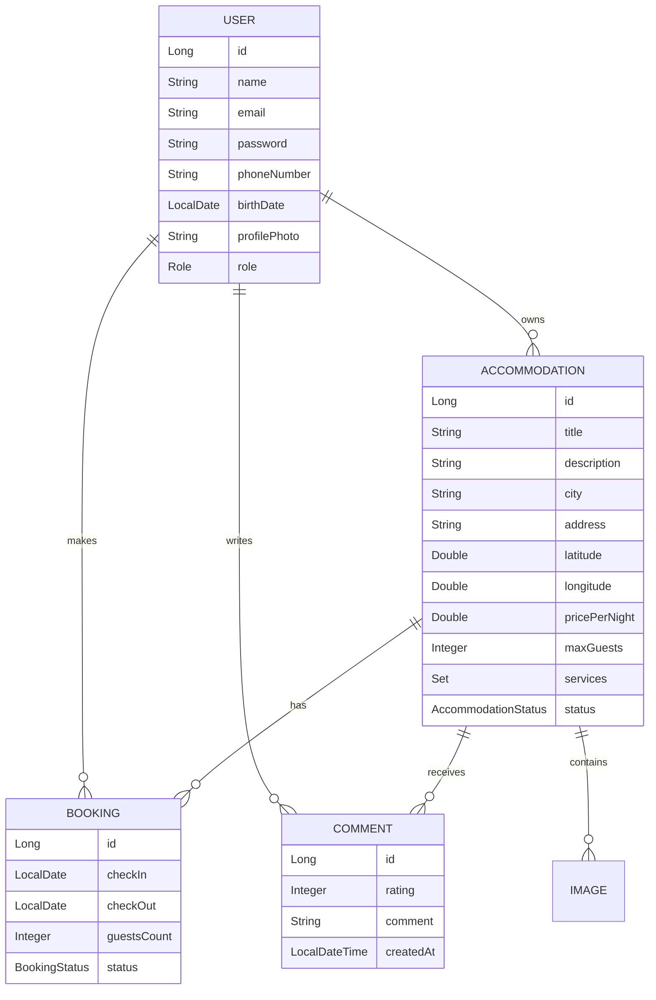

# 🏡 SnugPlace - Proyecto Final

---


## 👨‍💻 Autores

- **Willinton Vergara Cataño**
- **Juan Pablo López Gómez**

---

## 📖 Descripción

**SnugPlace** es una plataforma web completa para la gestión de alojamientos turísticos, inspirada en servicios como Airbnb. Permite a los anfitriones publicar y administrar sus propiedades (casas, apartamentos, fincas), mientras que los usuarios pueden buscar, reservar y calificar alojamientos de forma intuitiva y segura.

Este proyecto fue desarrollado como trabajo final para la materia de **Programación Avanzada** del programa de Ingeniería de Sistemas y Computación de la **Universidad del Quindío** 💚.

---

## ✨ Características Principales

### 🔐 **Gestión de Usuarios**
- Sistema de registro con validación completa de datos
- Autenticación segura mediante JWT (JSON Web Tokens)
- Roles diferenciados: **Usuario** y **Anfitrión**
- Recuperación de contraseña mediante código de verificación por correo
- Edición de perfil, cambio de contraseña y cambio de foto de perfil almacenada en Cloudinary

### 🏠 **Gestión de Alojamientos**
- Creación de alojamientos con información detallada
- Galería con imagen principal
- Ubicación interactiva mediante integración con **Mapbox**
- Gestión completa: Crear, Leer, Actualizar y Eliminar (CRUD)
- Soft delete para mantener historial
- Validación de eliminación (no permitida si hay reservas futuras)

### 🔍 **Sistema de Búsqueda Avanzada**
- Búsqueda por ciudad
- Filtros por fechas de disponibilidad
- Filtros por rango de precios (deslizador interactivo)
- Filtros por servicios (WiFi, Piscina, Gimnasio, etc...)
- Paginación de resultados (8 por página)
- Visualización en mapa con ubicaciones exactas

### 📅 **Sistema de Reservas**
- Calendario interactivo para selección de fechas
- Validación de disponibilidad en tiempo real
- Verificación de capacidad máxima de huéspedes
- Cancelación de reservas (hasta 48h antes del check-in)
- Historial completo de reservas (activas, pasadas, canceladas)
- Notificaciones por correo electrónico

### ⭐ **Sistema de Calificaciones**
- Calificación de 1-5 estrellas
- Comentarios de hasta 500 caracteres - En desarrollo
- Solo usuarios con estadías completadas pueden comentar - En desarrollo
- Respuestas de anfitriones a comentarios - En desarrollo
- Promedio de calificaciones visible

### 📊 **Panel de Métricas para Anfitriones**
- Número de reservas por alojamiento
- Promedio de calificaciones
- Filtros por rango de fechas
- Visualización de reservas con diferentes estados

---

## 🛠 Tecnologías Utilizadas

### **Backend**
```
🔹 Spring Boot 
🔹 Spring Security (JWT Authentication)
🔹 Spring Data JPA
🔹 MariaDB
🔹 Hibernate
🔹 Gradle
🔹 Cloudinary (Almacenamiento de imágenes)
🔹 JavaMail (Envío de correos)
```

### **Frontend**
```
🔹 Angular 18
🔹 TypeScript
🔹 RxJS
🔹 Angular Material / Bootstrap
🔹 Mapbox GL JS (Mapas interactivos)
🔹 SweetAlert2 (Alertas elegantes)
🔹 CSS3 
```

### **Herramientas y Servicios**
```
🔹 Git & GitHub (Control de versiones)
🔹 Pruebas HTTP (Testing de API)
🔹 IntelliJ IDEA / VS Code
🔹 Cloudinary (Para almacenar imágenes)
🔹 Mapbox (Servicio de mapas)
```

---

## 🏗 Arquitectura del Sistema

### **Modelo de Datos Principal - General**



## 🎓 Información Académica

- **Materia:** Programación Avanzada
- **Programa:** Ingeniería de Sistemas y Computación
- **Universidad:** Universidad del Quindío 💚
- **Docente:** Carlos Andrés Florez
- **Año:** 2025-2

---

## 📄 Licencia

Este proyecto es de uso académico y fue desarrollado como proyecto final de la materia Programación Avanzada de la Universidad del Quindío.

---

<div align="center">

**Desarrollado con ❤️ por Willinton Vergara y Juan Pablo López**

Universidad del Quindío 💚 - 2025


</div>
